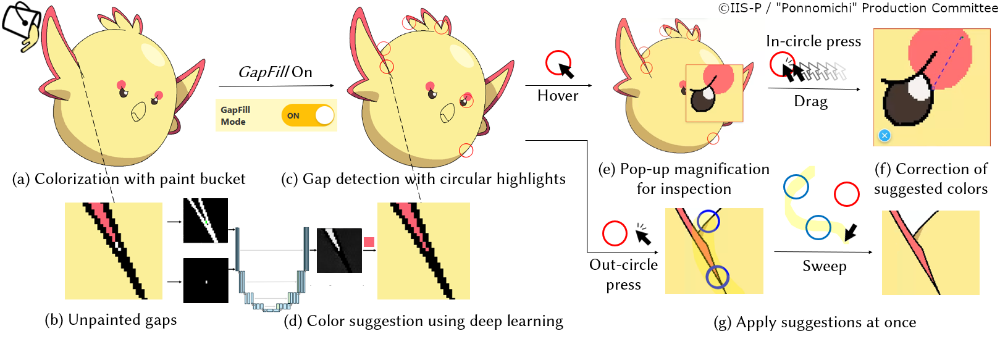
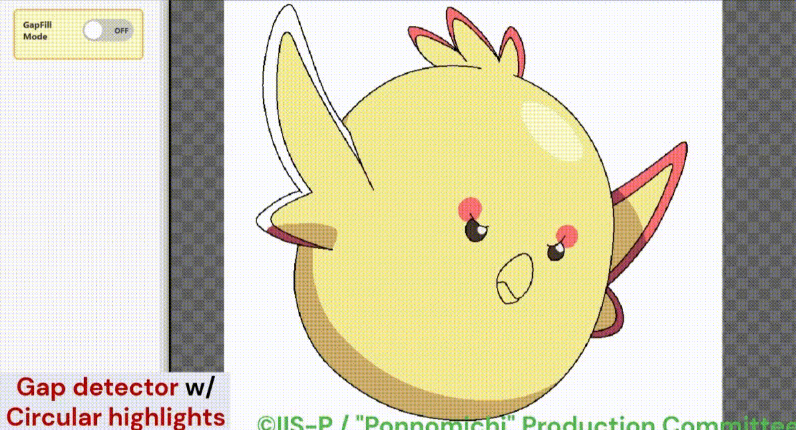

# GapFill: No Pixel Left Behind: Filling Gaps in Anime Colorization

[](https://doi.org/10.1145/3772318.3790968)
[](https://www.wiss.org/WISS2025Proceedings/data/demo/2-C15.pdf)
[](LICENSE)

[](https://marc2825.github.io/GapFill/)
[](https://gapfill-refactored.marckono2825-033.workers.dev/)





**GapFill** is an interactive tool for helping professional anime colorists
detect and fill small unpainted enclosed regions, or **"gaps" (塗り残し)** that are often
left behind during digital manual colorization.

The system automatically detects gaps, highlights them, and suggests fill
colors using a domain-specific deep-learning method that learns
correspondences between image regions. GapFill also provides pop-up
magnification, manual color correction, and sweep-to-apply interactions,
reducing the repetitive work of finding gaps, zooming in, and selecting colors.


## Quick Start

This repository contains the following primary components. Refer to the README
for each component for installation, data preparation, and usage instructions.

| Component | Description | Setup and usage |
|---|---|---|
| Web application (`web/`) | Interactive GapFill interface for detecting, inspecting, and filling gaps | [Web application README](web/README.md) |
| Krita plug-in (`krita-plugin/`) | GapFill plug-in for the Krita digital painting application, with model-assisted previews and canvas interactions | [Krita plug-in README](krita-plugin/README.md) |
| Machine-learning pipeline (`ml/`) | Data preprocessing, model training, evaluation, and visualization | [ML pipeline README](ml/README.md) |

The CSP Gap Assist research prototype is kept in `experimental/csp-plugin/`; it
is not a distributed or supported add-on.

## Development Branches

Other branches in this repository contain work in progress and may be incomplete or unstable.

For a preview of **Overflow Flood Fill**, an experimental UI variant that uses the same GapFill model, see the [Overflow Flood Fill Preview](https://github.com/marc2825/GapFill/tree/feature/overflow-floodfill/web#overflow-flood-fill-preview).


## Notes on the Released Version

The model distributed with this repository was retrained after the paper was
submitted and achieved a small improvement in prediction accuracy. As a
result, its predictions may be slightly better than those produced by the
version used in the user study, particularly for Task B (previous 'wrong prediction').

The codebase was also refactored in preparation for its public release. If you
encounter any unexpected behavior or discrepancies, please do not hesitate to
report them through [GitHub Issues](https://github.com/marc2825/GapFill/issues).

## Citation

If you use GapFill in your research, please cite our paper:

```bibtex
@inproceedings{kono2026gapfill,
  author    = {Masahiro Kono and Akinobu Maejima and Yuki Koyama and
               Yotam Sechayk and Takeo Igarashi},
  title     = {No Pixel Left Behind: Filling Gaps in Anime Colorization},
  booktitle = {Proceedings of the 2026 CHI Conference on Human Factors in
               Computing Systems},
  year      = {2026},
  doi       = {10.1145/3772318.3790968}
}
```

Machine-readable citation metadata is available in [CITATION.cff](CITATION.cff).

## Image and Dataset Availability

All image materials used in this project were used with permission from
[©IIS-P / Ponnomichi Production Committee](https://ponnomichi-pr.com/).

**The repository and hosted demo grant no license to extract or use these
image materials independently. Without separate permission from the copyright
holder, they may not be copied, modified, reused, or redistributed.**

Task C uses full, unmodified source images. These assets are intentionally not
distributed in this repository for copyright reasons and are ignored under
`web/public/preset-images/C/`. The dataset used to train the released model is
not distributed for the same reason.

Distributed preset images and documentation images contain embedded copyright
metadata. Please do not remove this metadata when using, copying, or processing the
images. See [ASSET_LICENSE.md](ASSET_LICENSE.md) for the complete asset and
training-data notice.

## License

The source code is released under the [MIT License](LICENSE). This license does
not grant rights to the third-party image materials described above.

## Updates

- **August 30, 2026:** GapFill plug-in for [Krita](https://krita.org) is released and available to download from [GitHub Releases](https://github.com/marc2825/GapFill/releases).
- **June 21, 2026:** Source code (refactored) for the web application is available.
- **June 18, 2026:** The trained GapFill model is available as
  `trained_model.pth` from [GitHub Releases](https://github.com/marc2825/GapFill/releases).
- **June 10, 2026:** Source code (refactored) for the GapFill model is available.
- **March 10, 2026:** The project website, paper, and demo web application are
  available.
