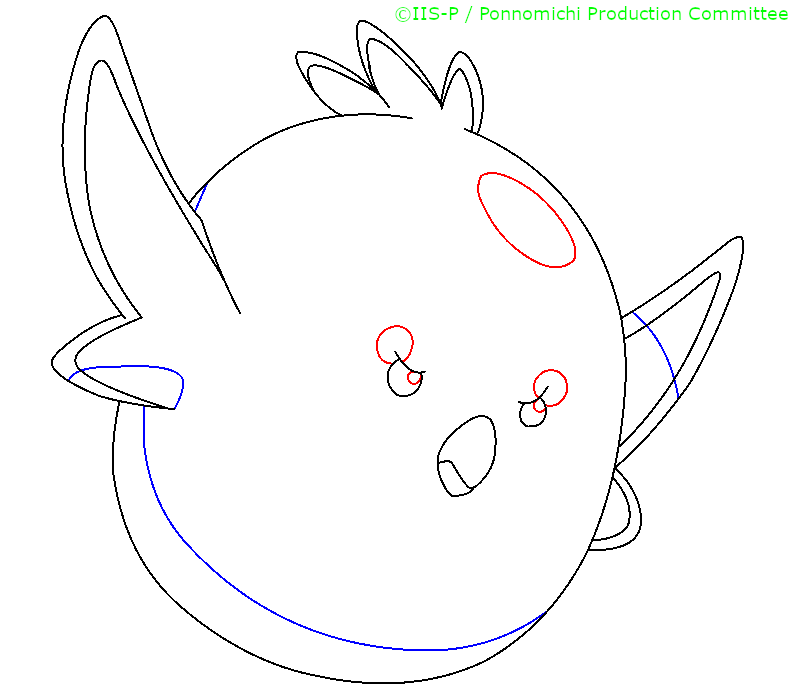

# GapFill ML Pipeline

This directory contains the machine-learning pipeline for GapFill. It covers:

1. **Region analysis** and **closest same-color label** generation
2. Training-patch **preprocessing**
3. U-Net-based GapFill model **training**
4. Model **evaluation** and optional **visualization**


## Directory Layout

The repository is expected to have a structure similar to:

```text
repository/
├── ml/
│   ├── README.md
│   ├── requirements.txt
│   └── src/
│       ├── analyze_regions.py
│       ├── preprocess_data.py
│       ├── train.py
│       ├── evaluate.py
│       ├── config.py
│       ├── models/
│       ├── pipelines/
│       └── utils/
└── web/
    └── ...
```

Run all commands in this document from the `ml/` directory.


## Environment Setup

Python 3.12 on WSL2 (Ubuntu 22.04 LTS or later) is recommended (tested environment).

```bash
cd ml
python3 -m venv .venv
source .venv/bin/activate
python -m pip install --upgrade pip
python -m pip install -r requirements.txt
```

The main dependencies are PyTorch, NumPy, pandas, OpenCV, SciPy, h5py,
TensorBoard, and tqdm.

For GPU training, ensure that the installed PyTorch build is compatible with the
CUDA version available on the machine.


## Input Data

Prepare **paired line-art and colored images**. Corresponding files must have the
same filename, including the extension.

```text
ml/
└── data/
    ├── line_art/
    │   ├── image_001.png
    │   └── image_002.png
    └── colored/
        ├── image_001.png
        └── image_002.png
```

Supported image extensions are `.png`, `.jpg`, `.jpeg`, and `.tga`.

- Line-art images are loaded as grayscale images.
- Colored images are used to determine representative region colors.

The line-art and colored images must have identical filenames and dimensions.
For example, the following files would both be named `example.png` in their
respective input directories.

<table>
  <tr>
    <th>Line art (<code>data/line_art/example.png</code>)</th>
    <th>Colored reference (<code>data/colored/example.png</code>)</th>
  </tr>
  <tr>
    <td></td>
    <td></td>
  </tr>
</table>


## Quick Start

The standard workflow is:

```text
analyze_regions -> preprocess_data -> train -> evaluate (&visualize)
```

With data under `data/line_art` and `data/colored`, the minimum command sequence
is:

```bash
python -m src.analyze_regions
python -m src.preprocess_data

python -m src.train \
  --device cuda

python -m src.evaluate gapfill
```

The output of each stage is used as the default input of the next stage.


## 1. Analyze Regions

The analysis stage **segments connected regions** in each line-art image (same as **flood-fill** operation)
and finds **the closest larger region** with the same color.

```bash
python -m src.analyze_regions \
  --flood_threshold 128 \
  --region_size_threshold 10 \
  --timeout_seconds 30
```

Default output:

```text
region_analysis/
└── nearest_same_color_analysis.csv
```

The generated CSV becomes the default input for both preprocessing and evaluation.

Useful options:

- `--output_dir`: Override the analysis output directory.
- `--num_samples`: Limit the number of source images.
- `--flood_threshold`: Set the line-art binarization threshold.
- `--region_size_threshold`: Set the maximum size of regions treated as small target regions (potential **gaps**).
- `--save_combined_images`: Also save `combined/*_combined.png`, with region-labeled line art and the colored image side by side.


## 2. Preprocess Training Data

The **preprocessing** stage reads the analysis CSV and creates model input and target patches.

```bash
python -m src.preprocess_data --crop_size 32
```

By default:

- The CSV is read from `region_analysis/nearest_same_color_analysis.csv`.
- Source images are split into training and validation sets by filename.
- The default train/validation ratio is `0.8 / 0.2`.
- Augmentation is applied only to the training set.
- Patches are stored as HDF5.

Default output:

```text
patches/
├── train/
│   ├── inputs.h5
│   └── targets.h5
└── val/
    ├── inputs.h5
    └── targets.h5
```

The model uses four downsampling stages, so `crop_size` must be a positive
multiple of 16. The default is `32`.

Useful options:

- `--csv_file`: Use a different region-analysis CSV.
- `--output_dir`: Override the patch output directory.
- `--train_val_split`: Change the source-image split ratio.
- `--seed`: Control the reproducible image-level split.
- `--no_augment`: Disable training augmentation.
- `--use_npy`: Store individual NPY files instead of HDF5.

When using NPY files, use `--use_npy` during both preprocessing and training.


## 3. Train the Model

**Train `NearestRegionUNet`** (GapFill's model) using the generated patches:

```bash
python -m src.train \
  --device cuda \
  --crop_size 32 \
  --batch_size 64 \
  --num_epochs 100
```

For CPU training:

```bash
python -m src.train --device cpu
```

Default input:

```text
patches/
```

Default training output:

```text
saved_models/gapfill/
├── checkpoints/
│   ├── best_model.pth
│   ├── final_model.pth
│   └── model_epoch_*.pth
├── logs/
└── history.json
```

The best validation checkpoint is saved to:

```text
saved_models/gapfill/checkpoints/best_model.pth
```

This path is also the default model path used during evaluation.

Useful options:

- `--data_dir`: Override the preprocessed patch directory.
- `--output_dir`: Override the model output directory.
- `--lr`: Set the learning rate.
- `--weight_decay`: Set optimizer weight decay.
- `--patience`: Set early-stopping patience.
- `--save_interval`: Set periodic checkpoint frequency.
- `--num_workers`: Set the number of DataLoader workers.
- `--use_npy`: Train from NPY patches instead of HDF5.

### Distributed Training

For example, to train with two GPUs:

```bash
torchrun --nproc_per_node=2 -m src.train \
  --device cuda \
  --backend nccl \
  --batch_size 64
```

The training pipeline uses `DistributedSampler` and updates its epoch before each training epoch.


## 4. Evaluate and Visualize

### **GapFill** Model

**Evaluate** the trained model and create **visualization** grids (optional):

```bash
python -m src.evaluate gapfill
```

Default inputs:

- CSV: `region_analysis/nearest_same_color_analysis.csv`
- Model: `saved_models/gapfill/checkpoints/best_model.pth`
- Crop size: `32`

Default output: `results/gapfill/`

Typical output:

```text
results/gapfill/
├── color_comparison.csv
├── color_summary.txt
└── visualizations/
    └── *_visualization.png
```

Useful options:

- `--model_path`: Evaluate a different checkpoint.
- `--csv_file`: Use a different analysis CSV.
- `--samples`: Limit the number of evaluated samples.
- `--comparison_crop_size`: Restrict color selection to a centered portion of the model output.
- `--show_labels`: Add labels to visualization panels.
- `--save_raw_predictions`: Also save input, target, and prediction arrays as NPY files.
- `--results_only`: Skip per-sample visualization and save only the CSV and summary.

### Greedy Baseline

The greedy mode evaluates a non-neural baseline using colors adjacent (8-connected) to the target region:

```bash
python -m src.evaluate greedy
```

It produces the same evaluation CSV and summary format, making its results
directly comparable with the GapFill model.


## Configuration

Default paths and hyperparameters are defined in `src/config.py`.

Important defaults include:

| Setting | Default |
|---|---|
| Line-art input | `data/line_art/` |
| Colored input | `data/colored/` |
| Region-analysis output | `region_analysis/` |
| Analysis CSV | `region_analysis/nearest_same_color_analysis.csv` |
| Training patches | `patches/` |
| Model output | `saved_models/gapfill/` |
| Best checkpoint | `saved_models/gapfill/checkpoints/best_model.pth` |
| GapFill evaluation output | `results/gapfill/` |
| Greedy evaluation output | `results/greedy/` |
| Patch size | `32` |
| Batch size | `64` |
| Training split | `0.8` |
| HDF5 storage | Enabled |

CLI arguments override these defaults without requiring changes to
`src/config.py`.


## Source Overview

- `src/analyze_regions.py`: Region-analysis CLI.
- `src/preprocess_data.py`: Training-data preprocessing CLI.
- `src/train.py`: Model-training CLI.
- `src/evaluate.py`: GapFill and greedy evaluation CLI.
- `src/models/`: U-Net model and reusable network blocks.
- `src/pipelines/`: Preprocessing, training, inference, and baseline workflows.
- `src/utils/`: Flood-fill, patch, color, data-loading, and visualization
  helpers.

Use `python -m <module> --help` to see all available options, for example:

```bash
python -m src.analyze_regions --help
python -m src.preprocess_data --help
python -m src.train --help
python -m src.evaluate gapfill --help
```
